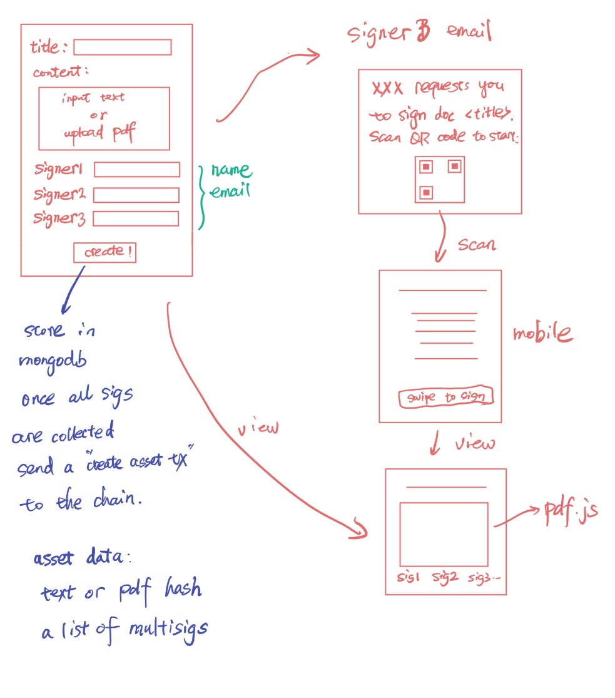
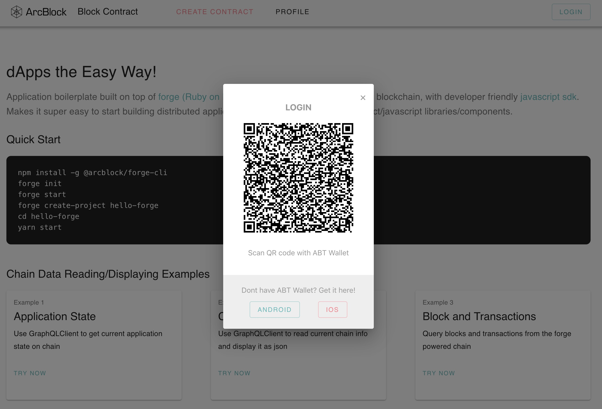
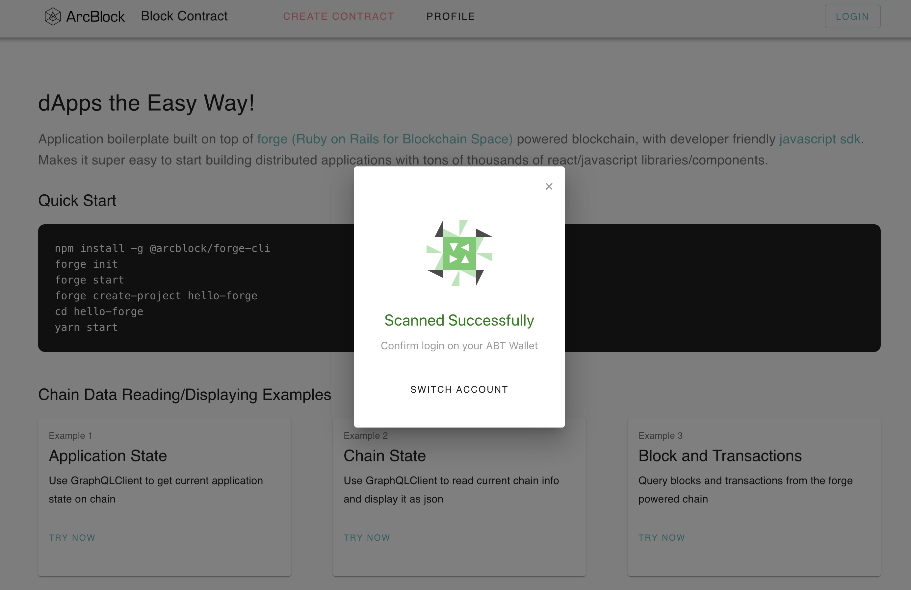
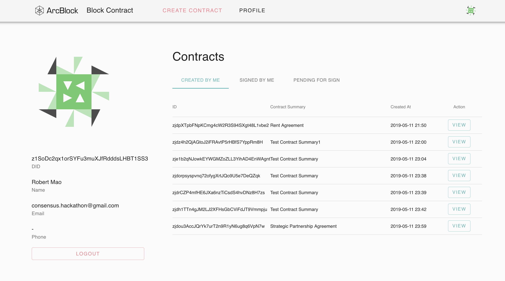
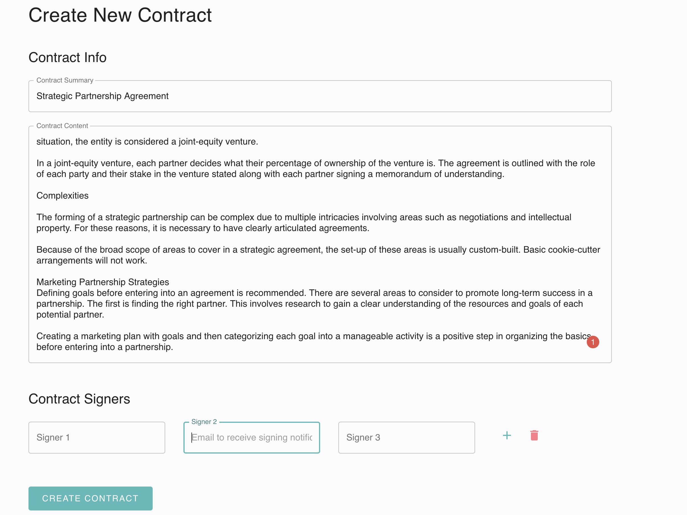
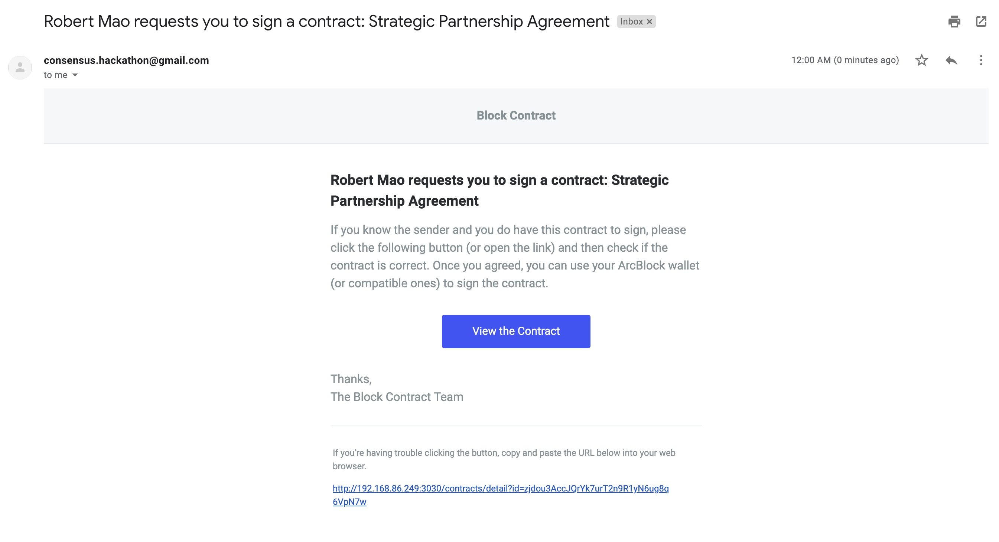
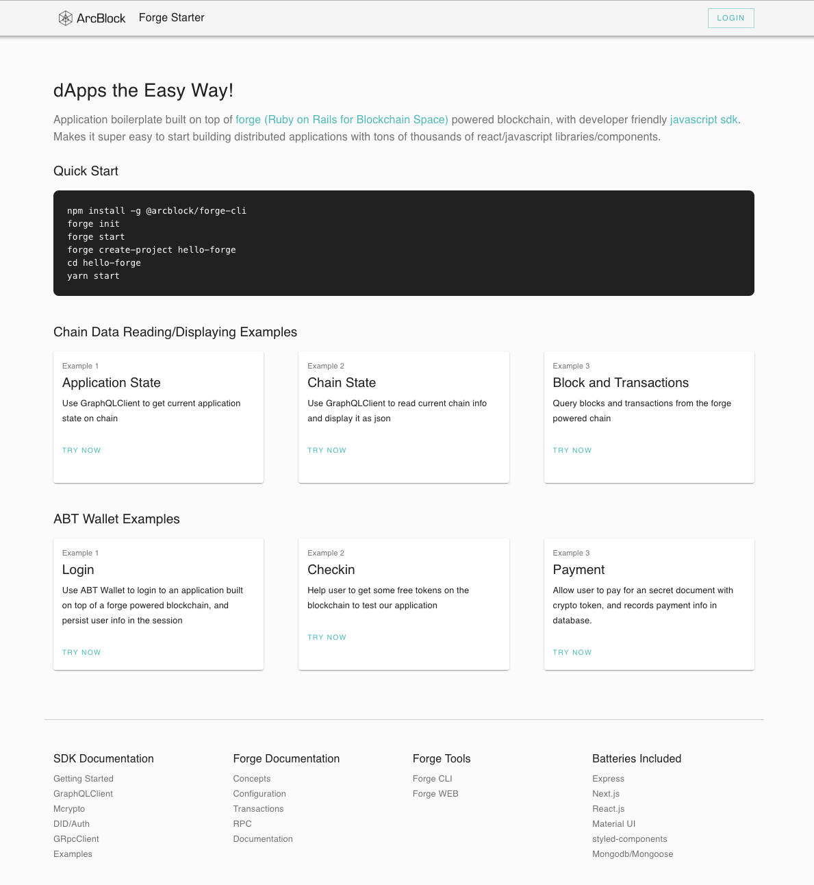

# Block Contract

This is a hackathon project for "The Building Blocks Hackathon at Consensus 2019" (https://consensus2019-blockchain.devpost.com).

Block contract is to build decentralized contract that people can sign, view and trust. To protect the privacy, the content of the contract will *NOT* be hosted in the blockchain, *only the hash* of the content is store in the chain.

We use [ArcBlock's Forge React Stater](#about-forge-react-starter) to build this application and let it handle the basic logic like DID login, so that we can focus on building the core logic.

## High level design

The prototype of the flow of the app looks like this:



## Contract Templates

[Accord Project](https://www.accordproject.org) is a great open source tool to generate legal contracts.  The ultimate goal is integrate this project with Accord [Legal Contract Template Studio](https://studio.accordproject.org).

## Blockchain

We will use ArcBlock's ForgeFrame to build a custom blockchain for this project's demo.  The block explorer lives here: [Block Contract Block Explorer](https://contract.abtnetwork.io/dashboard)

It's possible to use other blockchains, such as Ethereum, Bitcoin to record the contract through Open Chain Access Protocol (OCAP), but it will be limited in features.

## DB schema for contract

For contract created by the user, we store it as the following schema in mongo:

```javascript
const ContractSchema = new mongoose.Schema({
  // the did is calculated by sha3(concat(content, hash, signatures list without each sig))
  _id: { type: String, required: true, trim: true },
  requester: {type: String, required: true, trim: true},
  synopsis: { type: String, required: true, trim: true },
  content: { type: Buffer, required: true },
  hash: { type: String, required: true },
  signatures: [{
    name: { type: String, required: true, trim: true },
    email: { type: String, required: true, trim: true },
    signedAt: { type: Date },
    signature: { type: Buffer }
  }],
  finished: { type: Boolean, default: false},
  address: { type: String, default: '' },
  createdAt: { type: Date },
  updatedAt: { type: Date },
});
```

## Asset Schema for CreateAssetTx protocol

Once a doc is finished signing, we will send a CreateAssetTx to Forge, with its data like this:

```proto
message Signature {
  string name = 1;
  string email = 2;
  string signer = 3;
  google.protobuf.Timestamp signed_at = 4;
  bytes signature = 5;
}
message Contract {
  // did of the contract that stored in the Block Contract app
  string did = 1;
  // hash of the original contract to be signed
  string hash = 2;
  // collected signature list
  repeated Signature signatures = 3;
}
```

## Run this project from Repo

### Install latest nodejs and mongodb

```bash
brew upgrade node
brew install mongodb
brew services start mongodb
```

### Install latest forge-cli and init forge

```bash
npm install -g @arcblock/forge-cli
forge init
forge join https://contract.abtnetwork.io/api
forge start
forge web start
```

### Start the Block Contract app

```bash
cd block-contract
make dep
```

Before running the app, you need to put a `.env` file into your repo:

```bash
cat > .env
MONGO_URI="mongodb://127.0.0.1:27017/block-contract"
COOKIE_SECRET="0x6721a1883a8a9c08ea431a6528faf4c1a220194e8a3c0bed6159fd9737b4b7db"
CHAIN_ID="contract-2019-05-12"
CHAIN_HOST="https://contract.abtnetwork.io/api"
APP_NAME="Block Contract"
APP_PORT="3030"
APP_SK="0x93d1b3a3a75fd5d0a989bf91958442e15896e0c1cfa6a0d542a47861fdc8559e6721a1883a8a9c08ea431a6528faf4c1a220194e8a3c0bed6159fd9737b4b7db"
APP_ID="zNKgNRoV2s12JBsEB9dCc6RiqGYt5JHKRxqv"
EMAIL_USER="<your gmail address>"
EMAIL_PASS="<your gmail password>"
BASE_URL="http://<your-private-ip>:3030"
```

Note that you need to put your gmail user/pass and tune the BASE_URL here.

Make sure that you have your cellphone installed [ABT Wallet](https://abtwallet.io/en/) and it is under the same WIFI as your laptop running the app. Then:

```bash
make run
```

## Screen Shots

Pages are being added so screen shots will be gradually available:

### Scan QR code to login (provided by Forge React Starter kit)



After you scanned the QR code with ABT wallet:



Then you are redirect to profile page. User can see the existing contracts:



You may want to create a new contract:



And all the signers will go emails like this:



Below is created by forge-react-starter. Leave it just for your information.

---


## About Forge React Starter

This project is generated by ArcBlock's Forge React Starter:

> Brings tons of thousands react libraries/components to dApps that run on [forge](https://www.arcblock.io/en/forge-sdk) powered blockchain.



A starter project that integrates [forge](https://docs.arcblock.io/forge/latest/) [javascript sdk](https://docs.arcblock.io/forge/latest/sdk/javascript.html) with mainstream javascript application batteries:

- [React.js](https://reactjs.org/) the framework for view layer
- [Next.js](https://nextjs.org/) for crafting pages and SSR
- [Material-UI](https://material-ui.com/) for resuable react components
- [Express.js](http://expressjs.com/) as custom web server that can serve custom api
- [Mongoose](https://mongoosejs.com/) as database ORM layer

Forge SDK libraries included in the starter project:

- [@arcblock/graphql-client](https://www.npmjs.com/package/@arcblock/graphql-client) as communication layer between application and forge powered blockchain
- [@arcblock/did-auth](https://www.npmjs.com/package/@arcblock/did-auth) help application do jwt based auth with ABT wallet
- [@arcblock/did-auth-storage-mongo](https://www.npmjs.com/package/@arcblock/did-auth-storage-mongo) storage engines that powers the magic behind ABT Wallet qrcode scanning
- [@arcblock/react-forge](https://www.npmjs.com/package/@arcblock/react-forge) react components that can implements basic UI elements to connect your application with ABT Wallet, such as avatar and auth dialog

Other javascript project goodies:

- `eslint`: for consistent coding style
- `prettier`: for consistent code formatting
- `husky`: and `lint-staged` for prepush and precommit hooks
- `nodemon`: for auto restart server on node.js code change
- `next.js`: supports hot reload on client code change
- `dotenv`: to load configurations from `.env` files

## Folder Structure

```terminal
.
├── LICENSE
├── Makefile
├── README.md
├── app.js                    // application entry file
├── client                    // code for client side pages
│   ├── babel.config.js       // custom babel configuration
│   ├── components            // shared react components/layouts across all pages
│   ├── hooks                 // shared react hooks
│   ├── libs                  // shared utility code
│   ├── next.config.js        // custom next.js configuration
│   ├── pages                 // pages
│   └── static                // static assets that can be loaded by browser
├── package.json
├── server                    // backend code
│   ├── libs                  // shared server libs
│   ├── models                // mongoose db models
│   └── routes                // express routes and handlers
├── version
└── yarn.lock
```

## Runtime Requirements

- Mongodb v3+
- Node.js v10+
- That's all

## Usage

### Create new project with forge-cli

```terminal
npm install -g @arcblock/forge-cli
forge init
forge start
forge create-project hello-forge
cd hello-forge
npm start
```

### Just use this starter repo

> **Note: You have to setup an `.env` file manually.**

```terminal
git clone https://github.com/ArcBlock/forge-react-starter.git
cd forge-react-starter
yarn
```

## Configuration

dApp configuration file is auto generated and stored in `.env`, example configure as:

```text
MONGO_URI="mongodb://127.0.0.1:27017/forge-starter"
COOKIE_SECRET="71548f479c310ebc5bd972"
CHAIN_ID="forge"
CHAIN_HOST="http://192.168.1.6:8210/api"
APP_NAME="Forge Starter"
APP_PORT="3030"
APP_SK="0xd8ee2e2b73e0f3d7b7c5d53"
APP_ID="zNKtrS7etp2WQYnbVtknbDrVa23Q3eycdcDw"
BASE_URL="http://192.168.1.6:3030"
```

> Caution: `.env` contains very sensitive info such as Application wallet secret key, PLEASE DO NOT COMMIT `.env` FILE

## LICENSE

Licensed under the Apache License, Version 2.0 (the "License");
you may not use this file except in compliance with the License.
You may obtain a copy of the License at

    http://www.apache.org/licenses/LICENSE-2.0

Unless required by applicable law or agreed to in writing, software
distributed under the License is distributed on an "AS IS" BASIS,
WITHOUT WARRANTIES OR CONDITIONS OF ANY KIND, either express or implied.
See the License for the specific language governing permissions and
limitations under the License.
