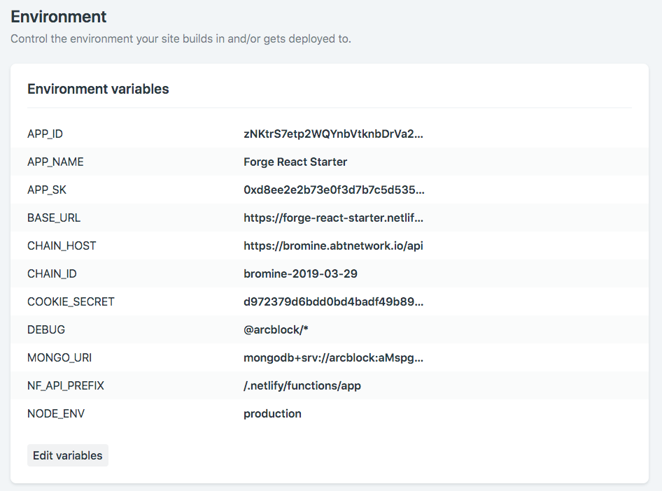

# Deployment

> This document describes steps of how to deploy an application created out of this starter to well known services

## Netlify

Netlify can be used to deploy both static pages and apis (lambda functions).

### 1. The API Code: `server/functions/app.js`

Most of the logic in `server/functions/app.js` should be the same with `app.js`:

- Must require and initialize all routes manually
- Must use prefix `/.netlify/functions/` for all routes

## 2. Configure Netlify Application

Configuration your application at [netlify](https://app.netlify.com/sites/forge-react-starter/settings/deploys) as following screenshot:

Most fields are from `.env` file, but pay extra attention to these required fields:

- `BASE_URL`: `https://forge-react-starter.netlify.com/.netlify/functions/app`
- `NF_API_PREFIX`: `/.netlify/functions/app`

For `MONGO_URI`, just need a connection string.

## Now.sh

> TODO
